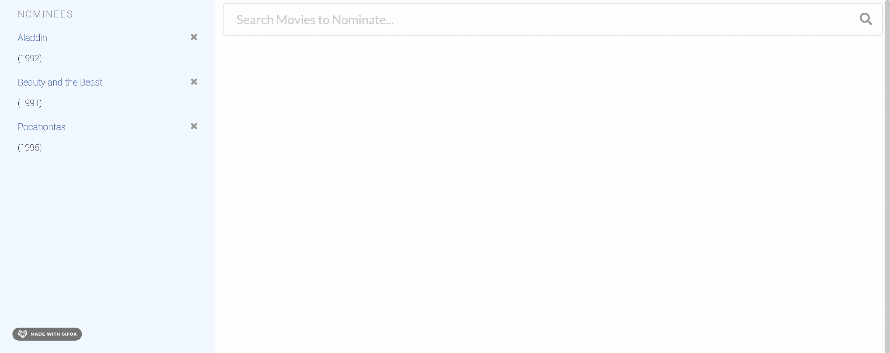

<!--
*** Thanks for checking out this README Template. If you have a suggestion that would
*** make this better, please fork the repo and create a pull request or simply open
*** an issue with the tag "enhancement".
*** Thanks again! Now go create something AMAZING! :D
***
***
***
*** To avoid retyping too much info. Do a search and replace for the following:
*** github_username, repo_name, twitter_handle, email
-->

<!-- PROJECT SHIELDS -->
<!--
*** I'm using markdown "reference style" links for readability.
*** Reference links are enclosed in brackets [ ] instead of parentheses ( ).
*** See the bottom of this document for the declaration of the reference variables
*** for contributors-url, forks-url, etc. This is an optional, concise syntax you may use.
*** https://www.markdownguide.org/basic-syntax/#reference-style-links
-->

<!-- PROJECT LOGO -->
<br />
<p align="center">
  <h3 align="center"><a href="https://emleechan.github.io/ombd-movie-app/">OMDB MOVIE NOMINATION WEB APPLICATION</a></h3>
  <p align="center">
    Shopify's Web Developer Intern Challenge - Winter 2021
    <br />
    <a href="https://emleechan.github.io/ombd-movie-app/">View Demo</a>
  </p>
</p>


<!-- ABOUT THE PROJECT -->
## About The Project


<!--[![Product Name Screen Shot][product-screenshot]](https://example.com)-->

Webage can search OMDB for movies, allowing to save films for nomination. Currently, 5 nominees can be selected and a banner will appear.
It can:

* Search OMDB and display the results (movies only)
* Add a movie from the search results to our nomination list
* View the list of films already nominated
* Remove a nominee from the nomination list
* Save nomination lists if the user leaves the page
* Immediate Search Results
* Persistent nomininees

<!-- TABLE OF CONTENTS -->
## Table of Contents

* [About the Project](#about-the-project)
  * [Built With](#built-with)
* [Getting Started](#getting-started)
  * [Installation](#installation)
* [Usage](#usage)
* [Roadmap](#roadmap)
* [Contact](#contact)

### Built With
* [create-react-app](https://github.com/facebook/create-react-app)
* [Semantic UI](https://semantic-ui.com/)
* [OMDB](http://www.omdbapi.com/)


<!-- GETTING STARTED -->
## Getting Started

To get a local copy up and running follow these simple steps.


### To Run Locally

1. Clone the repo
```sh
git clone https://github.com/emleechan/ombd-movie-app.git
```
2. Install NPM packages
```sh
npm install or yarn install
```
3. Install NPM packages
```sh
npm run or yarn run
```

<!-- ROADMAP -->
## Roadmap

See the [open issues](https://github.com/emleechan/ombd-movie-app/projects/1) for a list of proposed features (and known issues).

<!-- Contact -->
## Contact

Hit me up here: [emc15@sfu.ca](mailto:emc15@sfu.ca) :)


